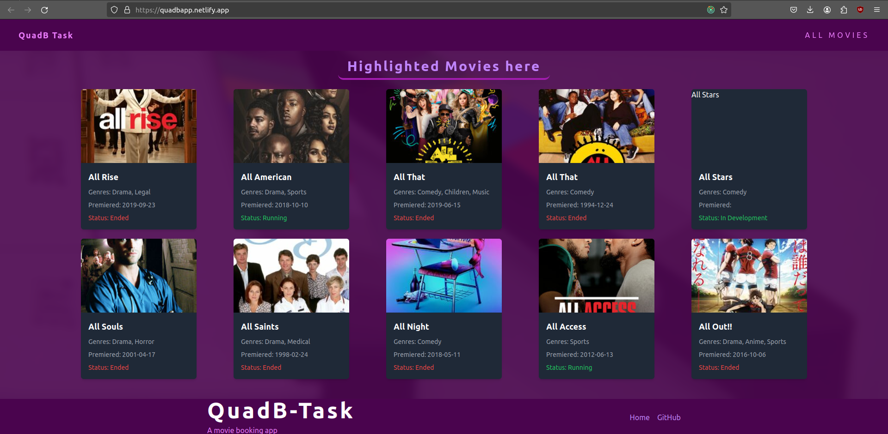
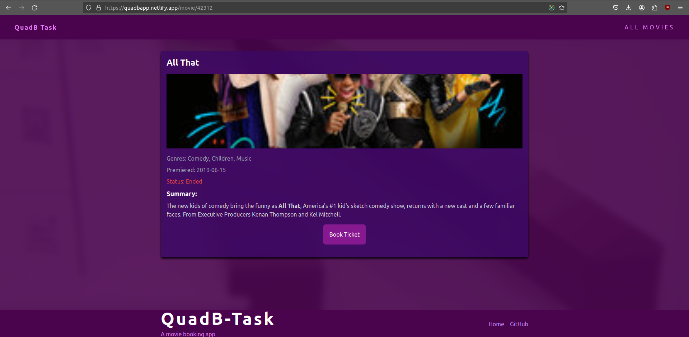
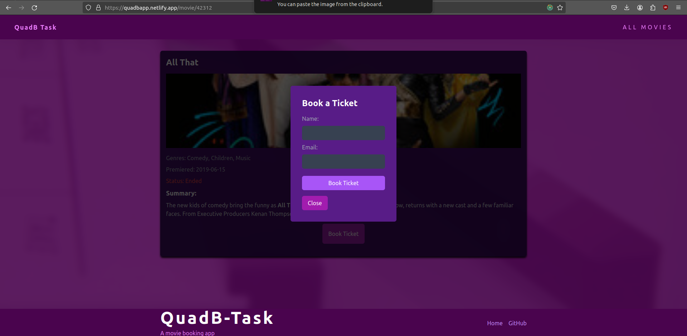

# QuadB Task - Movie Booking App

## Overview

QuadB Task is a simple Movie Booking App developed using React, Redux Toolkit, and TailwindCSS. This app fetches movie data from an external API, maintains user details in local storage, and allows users to book tickets for their favorite movies.

Deployed link : [QuadB-task Netlify](https://quadbapp.netlify.app/)



## Features

- **Movie Listings:** View a list of highlighted movies.
- **Movie Details:** Click on a movie card to view detailed information about the selected movie.
- **Book Tickets:** Book tickets for your favorite movies by providing your name and email.
- **Persistent User Details:** User details are stored in local storage for a seamless experience.

## Technologies Used

- **React:** Front-end library for building user interfaces.
- **Redux Toolkit:** State management library for React applications.
- **TailwindCSS:** Utility-first CSS framework for styling.
- **API:** Fetches data from an external movie database.

## Getting Started

1. Clone the repository:

```bash
    git clone https://github.com/anchalraj31082004/quadb-task.git
```

2. Install dependencies:
```bash
    cd quadb-task
    npm install
```

3. Run the app
```bash
    npm run dev
```
4. Open your browser and visit http://localhost:5173 to view the app.

## Project Structure

* Home: Displays a list of highlighted movies.
* MovieDetail: Displays detailed information about a selected movie and allows users to book tickets.
* Footer: Displays information about the app and navigation links.

## Other Screenshots






### You can check the deployed link and contact at [E-mail](anchalraj20045@gmail.com) or [Twitter](https://twitter.com/AnchalTwt)

